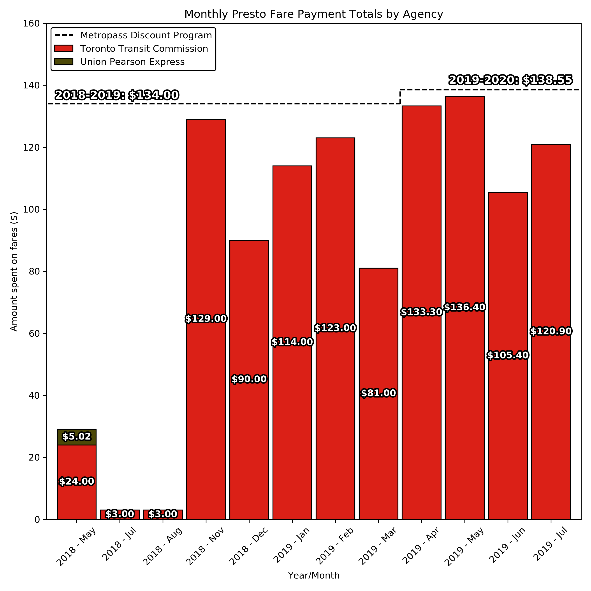

## Presto cost exploratory analysis
This repo is the result of me trying to figure out if I should reinvest in the TTC Metropass Discount Program now that Presto is out:



## Setup
#### Clone this repository:

Either fork or clone this repository to your local machine

#### Download your Presto transactions
1) Go to https://www.prestocard.ca/en/ 
2) Login and click on `Card Activity`
3) Change the `Date Range` to the earliest and latest dates possible
4) Click `View` to apply the new date range filter
5) Scroll down to the bottom and click `Export to CSV`
6) Save the `CSV` file to the `/notebooks/` subdirectory of the cloned repository

#### Python Environment
If you don't have Python and/or Conda, [install miniconda](https://conda.io/miniconda.html) for your platform. Then create the environment in a terminal with:
```
conda create -n py3-geovis python=3 jupyter pandas matplotlib
conda activate py3-geovis
cd /path/to/cloned/repo/notebooks/
jupyter-notebook
```

#### Running the code
In the Jupyter Home interface, find and open the `presto_costs.ipynb` notebook and run the cells to see some information on your Presto history and whether or not you should have bought a MDP.

To quit from the `presto_costs` notebook, use `File -> Close and Halt` which will return you to the Jupyter Home interface. You can then use the `Quit` button to close and shutdown Jupyter.

To quit from anywhere, use `Ctrl-C` within the terminal that is running Jupyter.
